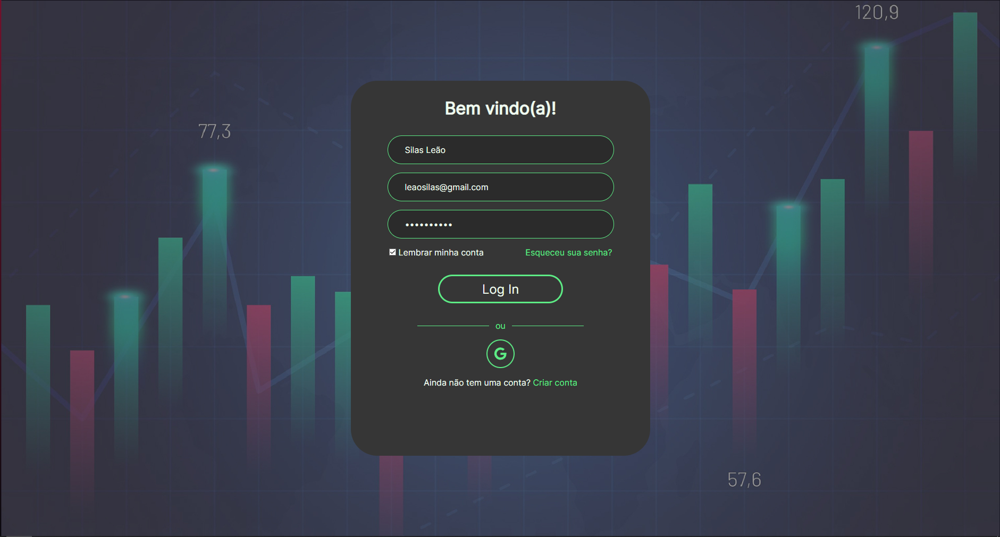
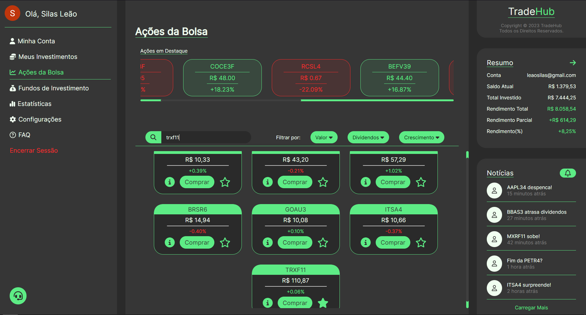
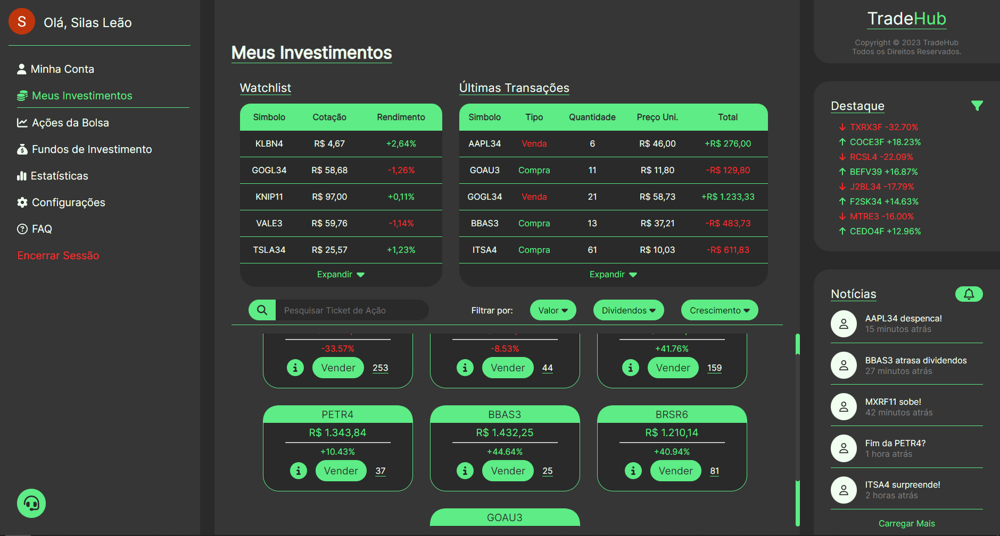

# TradeHub

> Status: Desenvolvendo ⚠️

## Descrição
Uma aplicação web que simula uma plataforma de investimentos 🚀

## ⚙️Tecnologias Utilizadas
- [Next.js](https://nextjs.org/docs)
- [JavaScript](https://developer.mozilla.org/en-US/docs/Web/JavaScript)
- [HTML5](https://developer.mozilla.org/en-US/docs/Web/HTML)
- [CSS3](https://developer.mozilla.org/en-US/docs/Web/CSS)
- [Brapi.dev Api](https://brapi.dev/docs)
- [Supabase](https://supabase.com/docs)
- [Next-Auth](https://next-auth.js.org/getting-started/introduction)
- [Biblioteca ChartJS](https://www.chartjs.org/docs/latest/)
- [React Icons](https://docs.fontawesome.com/v5/web/use-with/react)
- [React Hooks](https://pt-br.legacy.reactjs.org/docs/hooks-intro.html)
- [Next Router](https://nextjs.org/docs/pages/building-your-application/routing)

## 📱Funcionalidades do Projeto
### Landing Page
- Página inicial de apresentação, que encaminha o usuário para fazer login.
### Login
- Tela de login onde é possível entrar utilizando nome, e-mail e senha ou fazer login com sua conta do Google por meio do Next-Auth.
- (Todos os usuários acessam a mesma conta no banco de dados Supabase até o momento)
### Ações da Bolsa
- Carrossel com cards das ações destaque com maior e menor variação de preço no momento
- Campo de pesquisa por Tickets de ações, fundos imobiliários ou BDRs que retornam um card com as informações da ação pesquisada, com botões para mostrar mais informações com um gráfico gerado pela biblioteca ChartJS, entrar no menu de compra da ação ou favoritar e desfavoritar ações que vão ser guardadas na Watchlist da seção Meus Investimentos
- Resumo que informa alguns dados importantes da sua conta, obtidos do banco de dados Supabase de forma dinâmica
- Notícias mais relevantes ordenadas a partir da mais recente
- Todos os dados das ações são obtidos por meio de requisições à API da brapi.dev
### Meus Investimentos
- Watchlist expandível que mostra as ações favoritadas pelo usuário, permitindo excluir ações que não sejam mais do interesse do usuário
- Histórico de transação expandível onde são mostradas as transações de venda e compra de ações do usuário, sendo ordenadas a partir da mais recente
- Destaque que informa as ações destaque com maior e menor variação de preço em forma de texto
- Notícias mais relevantes ordenadas a partir da mais recente
- Campo de busca que permite filtrar as ações que o usuário possui através do ticket da ação
- Ações que o usuário possui guardadas no banco de dados Supabase são mostradas, informando o valor atual delas e a variação de preço, assim como também um botão que permite o usuário ver mais informações sobre aquela determinada ação, botão para entrar no menu de venda da ação e um contador que informa a quantidade de ações que o usuário possui
### Encerrar Sessão
- Funcionalidade de encerrar sessão e sair da conta do usuário
### Banco de Dados
- Todos os dados da aplicação são mantidos em um banco de dados Supabase, com objetivo de manter a aplicação funcional e dinâmica, de forma que os dados interajam entre si a partir de cálculos, edição, remoção e inserção 

## 💻Como Rodar este Projeto?

```bash
# Clone este repositório
$ git clone linkrepo

# Acesse a pasta do projeto no seu terminal
$ cd tradehub

# Instale o Next.js na versão 14.0.3 ou superior
$ npm install next@14.0.3
# ou
$ npm install next@latest

# Execute a aplicação
$ npm run dev

# A aplicação será iniciada na porta 3000, acesse pelo navegador: http://localhost:3000
```

## 🖥️Layouts
- Landing Page

- Login

- Ações da Bolsa

- Meus Investimentos

